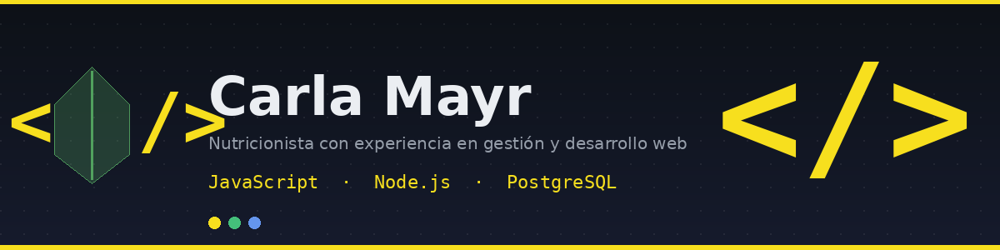
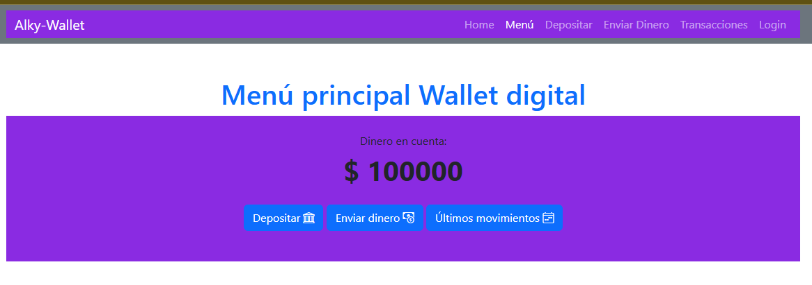
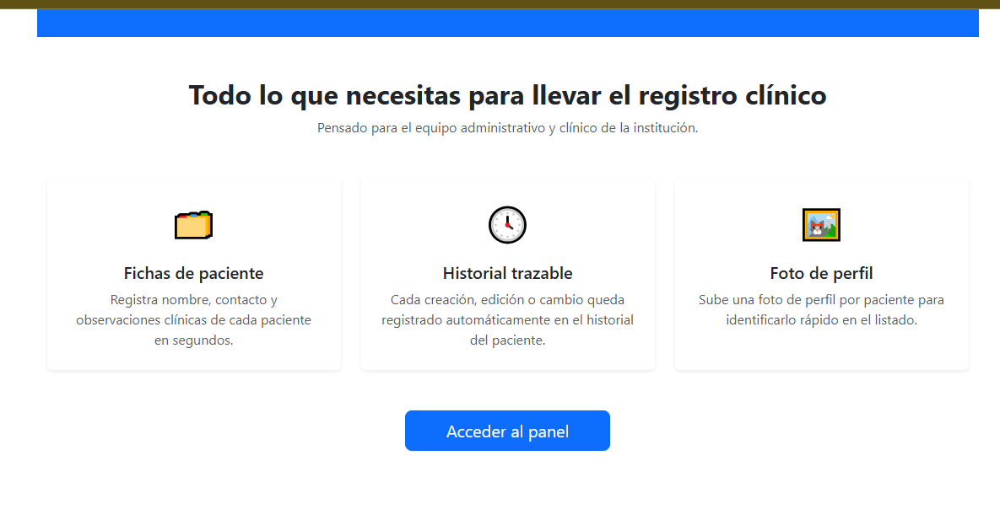

### 👋 Hola, soy Carla Mayr

**Nutricionista devenida en Developer · Combino 10+ años de experiencia en salud y gestión con mis primeros pasos en desarrollo de software 🥗➡️💻**

---

## 🧠 Sobre mí

Nutricionista con **+10 años de experiencia**, background en **administración y gestión de equipos**, y actualmente terminando mi formación **trainee en JavaScript**. Estoy transicionando al desarrollo de software con foco en el cruce entre **tecnología y salud**.

- 🎯 **Enfoque:** JavaScript, con base en HTML/CSS y Node.js
- 🚀 **Evolución:** Sumando Bases de Datos (PostgreSQL) y buenas prácticas con Git/GitHub
- 🌱 **Mentalidad:** Aprendizaje continuo, disciplina y foco en resultados forjados en +10 años de salud
- 🤝 **Diferencial:** años de trato con personas, resolución de problemas reales y gestión de equipos — algo que no se aprende en un curso

---

## 🛠️ Tech Stack

**Frontend**

**Backend & DB**

**Herramientas**

---

## 🚀 Proyectos Destacados

| Proyecto | Descripción | Preview |
|---|---|---|
| **[Nombre Proyecto 1]** | Breve descripción: qué hace, qué problema resuelve, qué aprendiste. `JavaScript · HTML · CSS` |  |
| | [🚀 Demo](enlace-demo) · [💻 Código](enlace-repo) | |
| **[Nombre Proyecto 2]** | Breve descripción. `Tecnologías` |  |
| | [🚀 Demo](enlace-demo) · [💻 Código](enlace-repo) | |

> 💡 Tip: si podés orientar uno de tus proyectos hacia nutrición (calculadora de macros, planificador de comidas, tracker de hábitos), es tu diferencial más fuerte frente a otros perfiles trainee.

---

## 📊 GitHub Stats

---

## 🐍 Actividad

---

## ⚡ Actualmente...

| Status | Topic |
|---|---|
| 🌱 **Aprendiendo** | JavaScript (nivel trainee) |
| 🧠 **Explorando** | Node.js & bases de datos relacionales |
| 🎯 **Buscando** | Primera oportunidad como Developer Jr. |
| 🤝 **Aportando** | Visión de gestión y experiencia con personas al equipo dev |

<em>Gracias por pasar por mi perfil ✨</em>
